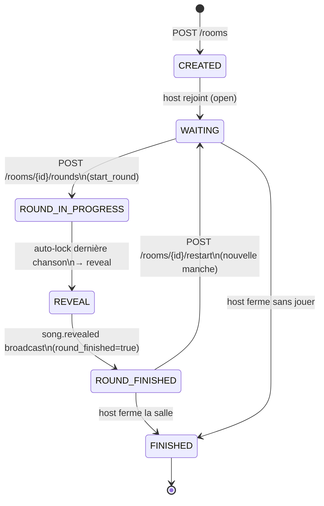
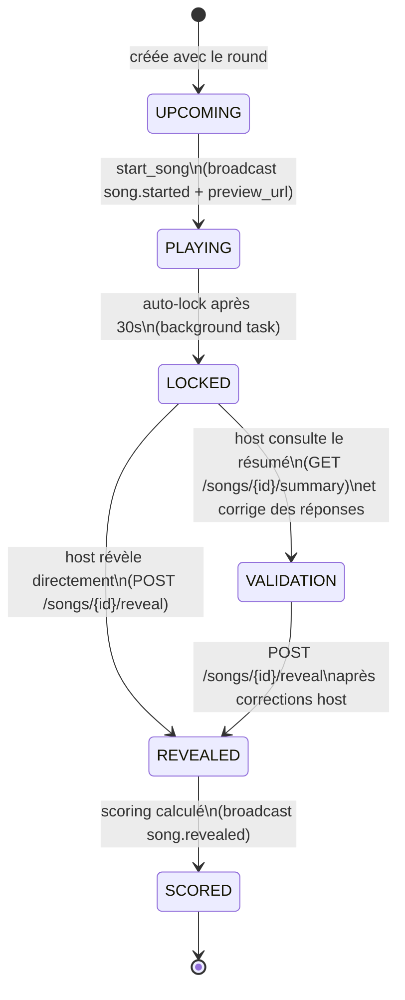
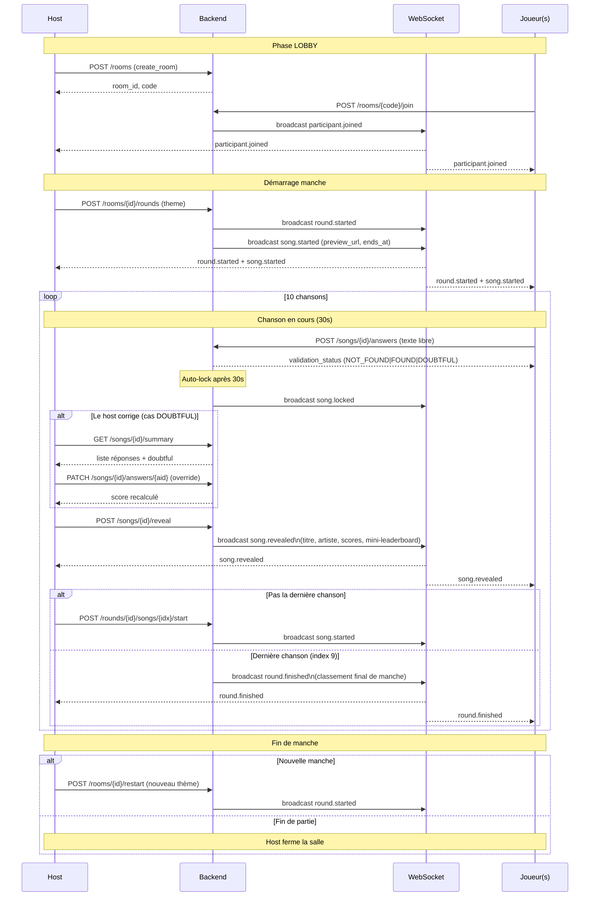
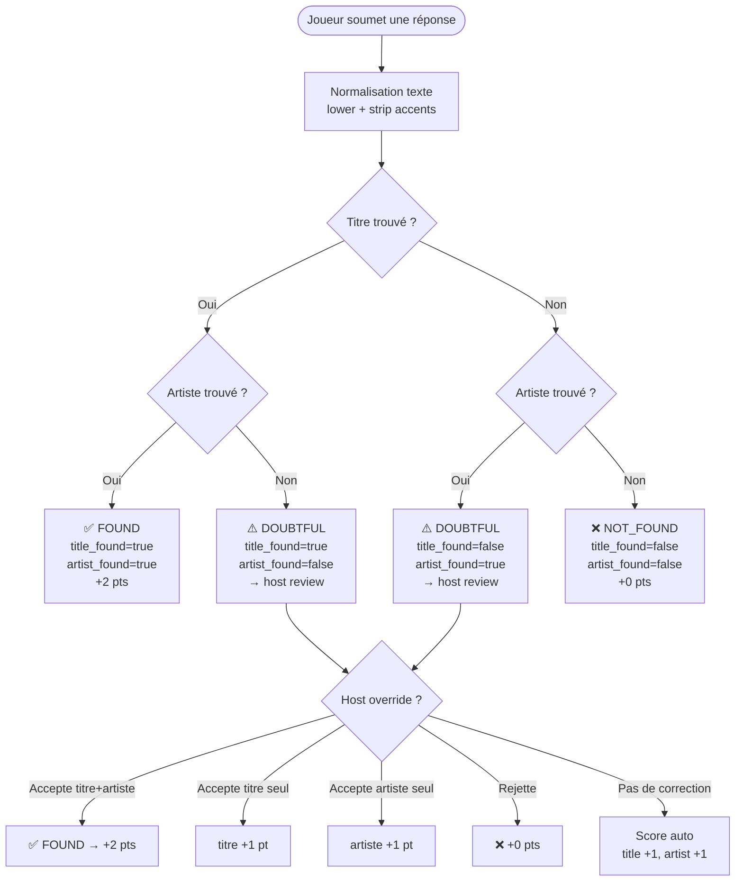
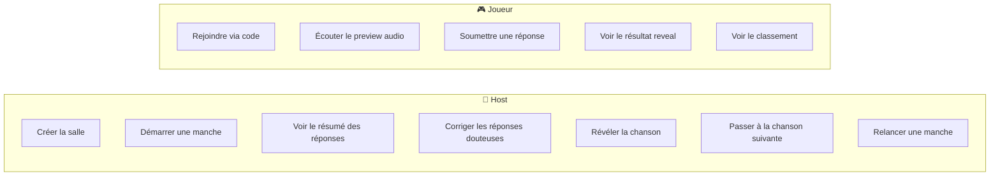

# Schéma des cas de jeu — Blindtest App

## 1. Machine à états — Salle (`Room`)

## 2. Machine à états — Chanson (`Song`)

## 3. Cycle complet d'une manche (diagramme de séquence)

## 4. Cas de validation d'une réponse joueur

## 5. Événements WebSocket émis par le backend

| Événement | Déclencheur | Destinataires | Payload clé |
|-----------|-------------|---------------|-------------|
| `participant.joined` | POST /rooms/{code}/join | Toute la salle | participant_id, nickname |
| `round.started` | POST /rooms/{id}/rounds | Toute la salle | round_id, theme, song_count |
| `song.started` | start_song | Toute la salle | song_id, song_index, preview_url, ends_at |
| `song.locked` | auto-lock background task | Toute la salle | song_id |
| `song.revealed` | POST /songs/{id}/reveal | Toute la salle | titre, artiste, scores, mini_leaderboard |
| `round.finished` | reveal dernière chanson | Toute la salle | round_leaderboard |

## 6. Rôles et permissions

